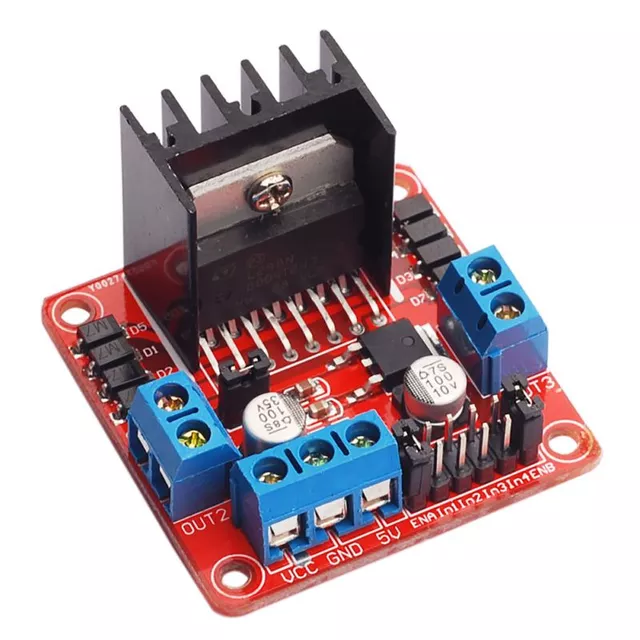
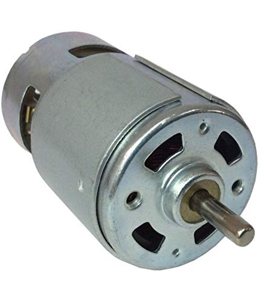

# Actuator

## Motor Driver

The L298N driver is utilized to supply energy to the motor from an external power source and to regulate the motor's operation using a PWM signal.

## Motor

In the experiment, a generic 12V DC motor was utilized.

