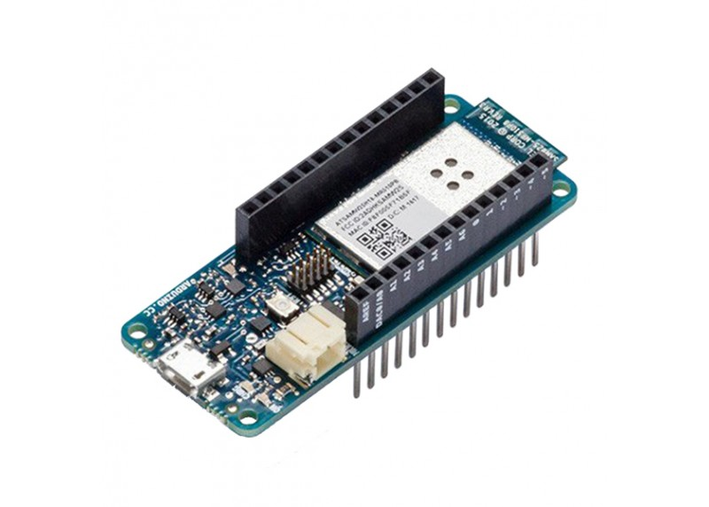

# Controller

## Arduino

For the experiment, a controller with efficient serial port communication capabilities was essential. The chosen device for this purpose was the Arduino MKR1000.

## Sensors 

The controller is required to have a minimum of two analog pins available for the connection of the following sensors:

1. [Thrust sensor](./sensores.md#sensor-de-empuje)
2. [Current Sensor](./sensores.md#sensor-de-corriente)

## Actuator

The actuator necessitates only a PWM pin from the controller to supply power to the motor via a [motor driver](./actuadores.md). 

