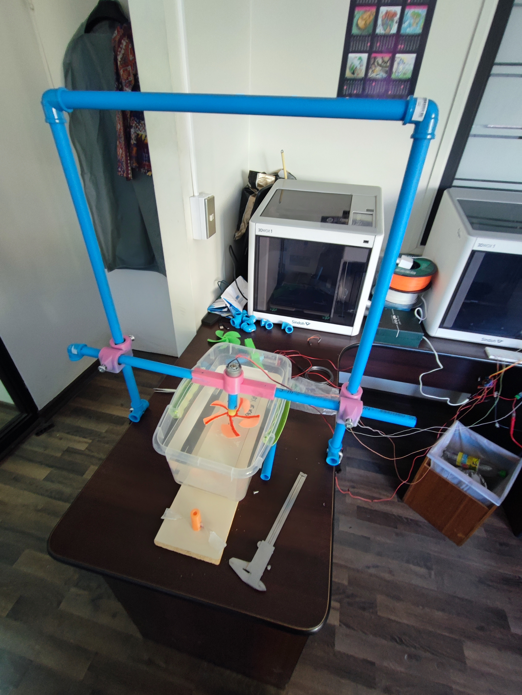

# The Laboratory

The Arduino board, along with its connections to the sensors and actuators components, is depicted in the following image.

The testbench, which houses the motor-propeller assembly, water reservoir, and thrust sensing, is depicted in the following image.

