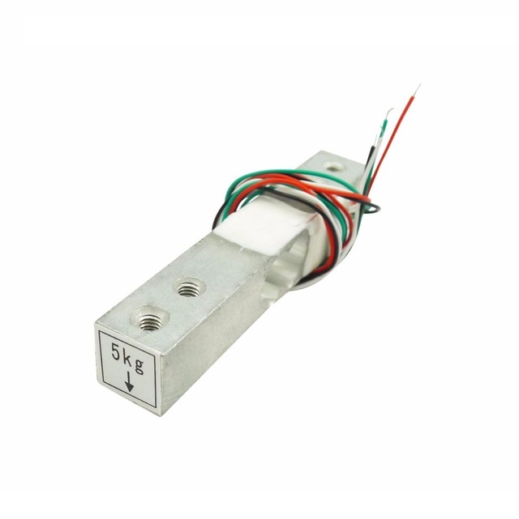
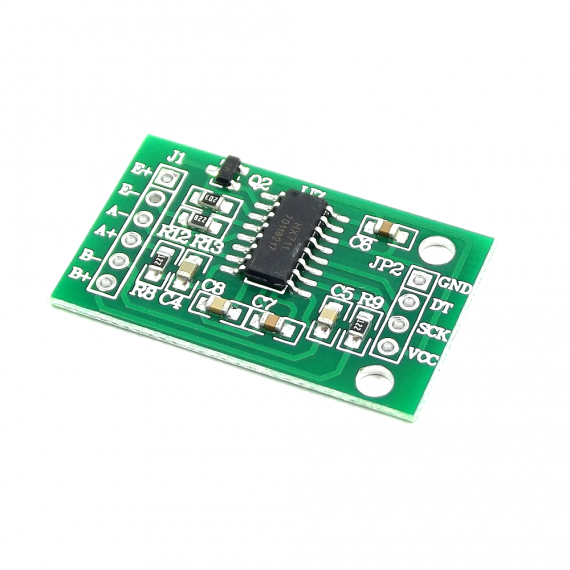
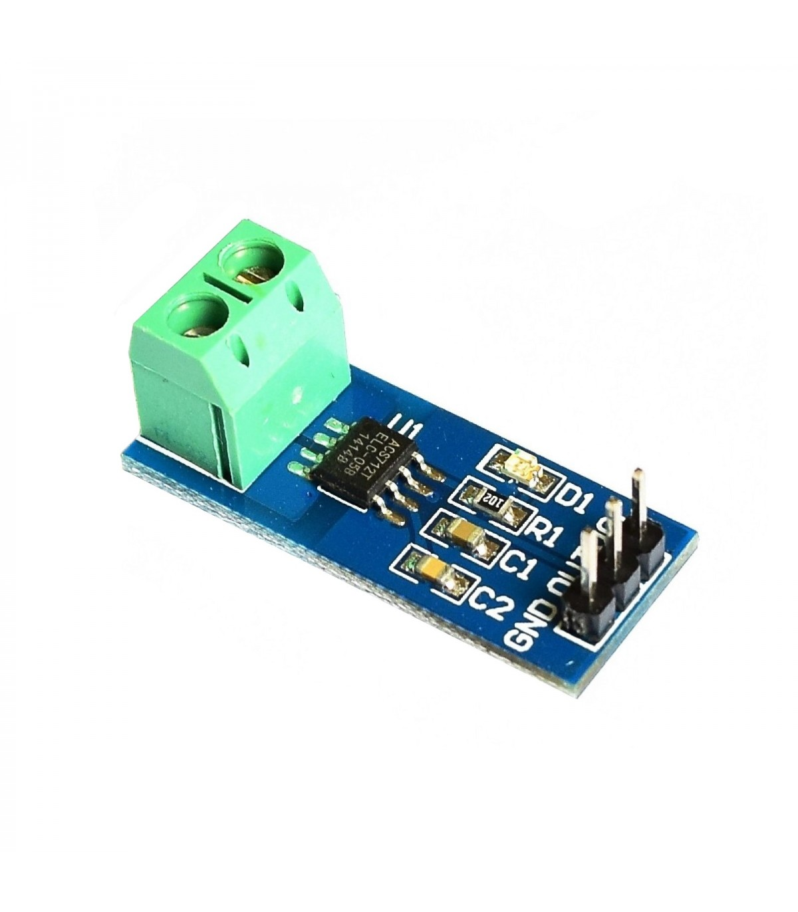

# Sensores

## Sensor de Empuje

Para medir el empuje en el sistema, se utiliza una galga extensiometrica de 5kg la cual requiere un amplificador HX711.

## Sensor de Corriente

Este sensor se encarga de captar la corriente que consume el motor a lo largo del experimento.

